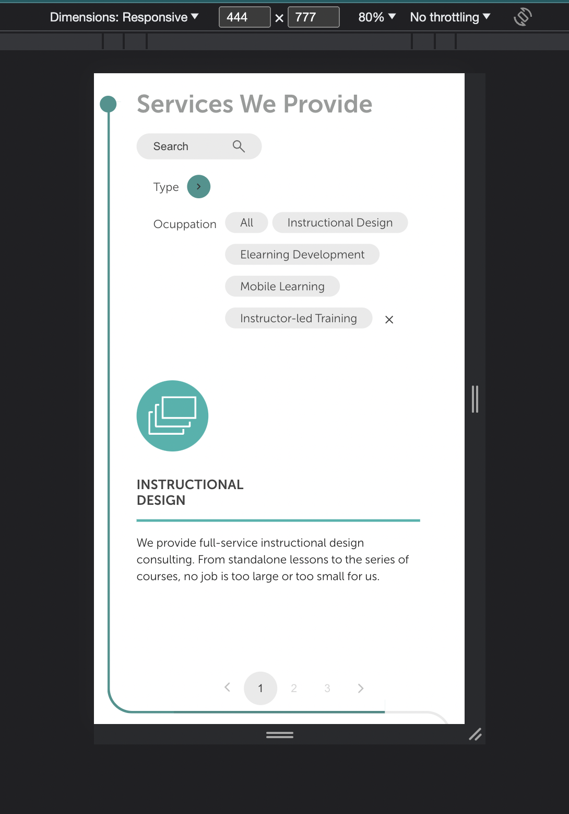

# Getting Started with eLearning
Deploy: [eLearning Company](https://elearning-sepia-eight.vercel.app/).

This README guide will help you get started with setting up and running the application on your local machine.

## Prerequisites

Before you begin, ensure that you have the following software installed on your system:

- Node.js: Make sure you have Node.js installed. You can download it from the official website: [Node.js](https://nodejs.org/)

## Installation

1. Clone this repository to your local machine using your preferred method (SSH or HTTPS):

   ```bash
   git clone https://github.com/EvaCherkashyna/elearning.git
   ```
   ```bash
   git clone git@github.com:EvaCherkashyna/elearning.git
   ```
   Copy and paste one of above commands into your terminal to clone the repository.

2. Navigate to the project directory:
  
    ```bash
      cd elearning
    ```

3. Install the project dependencies using npm (Node Package Manager):
   
    ```bash
    npm install
    ```

## Running the Application

Once you've completed the installation and configuration steps, you can run the React application. In the project directory, run:

  ```bash
  npm install
  ```
    
This will start the development server and open the application in your default web browser. Any changes you make to the source code will automatically update the application in the browser.


### In case of problem

  ```bash
  npm audit fix --force
  ```

if command above doesn't work try command below.

```bash
npm config set legacy-peer-deps true 
```


## Implemented features:

1. ### Dark-Light Theme Switch
  
  
  

1. ### Automatic Slider 
   
 
  
  

3. ### Service Filtering.
 
  
  
  
4. ### Navigational Links with Scroll: 
Implemented navigation links that smoothly scroll to specific sections, enhancing user-friendliness and ease of navigation.

5. ### Dynamic Border Color Change: 
Developed a feature that dynamically changes the border color from gray to green as the user scrolls down the page.

6. ### Mobile Responsiveness (375-767px): 

  

7. ### Desktop Responsiveness (1400px and above): 
  